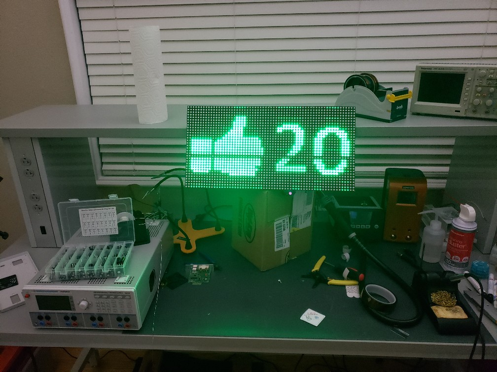
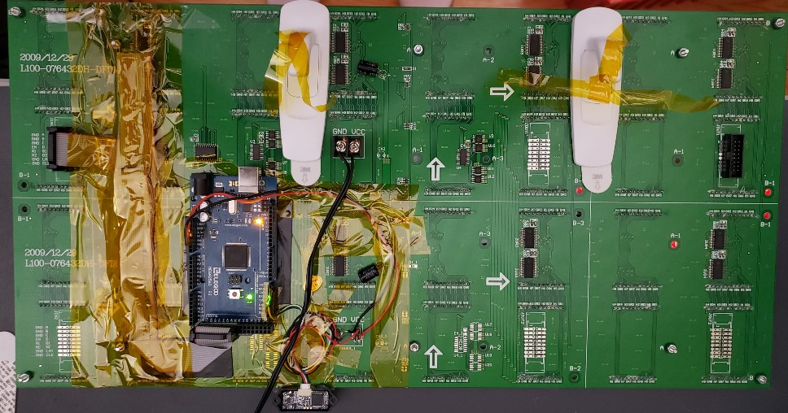
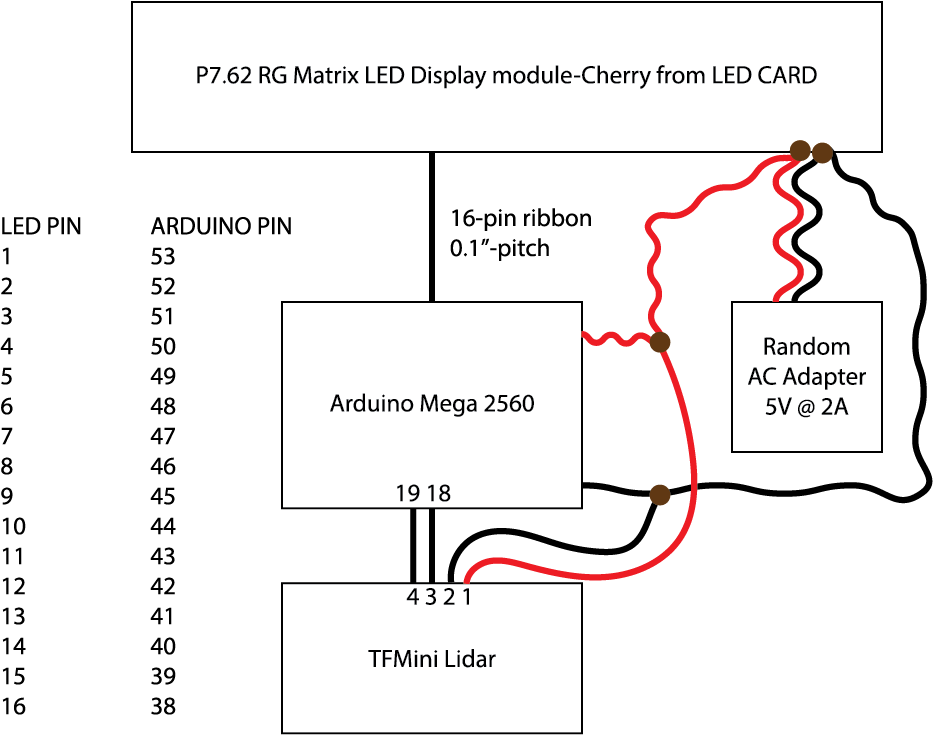

# Bumper to Bumper

Many people use a tennis ball on a string to precisely locate their car in their garage. I say "Who are we!? We can do better!". Bumper to Bumper is an LED matrix display and LIDAR for showing wall-to-bumper distance with icons to show the best parking spot so you don't bang your garage door on your bumper.

## Getting Started

This is an Arduino project (source code included). I ran it on an Arduino MEGA 2560, but it should run on any Arduino that supports [millis()](https://www.arduino.cc/reference/en/language/functions/time/millis/). Assemble the boards per the block diagram. Build and run the Arduino code. Thats it.

### Prerequisites

* https://learn.sparkfun.com/tutorials/tfmini---micro-lidar-module-hookup-guide/all

* https://www.led-card.com/p7-62-rg-matrix-led-display-module.html

* https://www.amazon.com/ARDUINO-MEGA-2560-REV3-A000067/dp/B0046AMGW0

### Notes

I built this for around $125.95 + tax + S&H. I didn't try to optimize the parts I was using, so it could likely be built cheaper.

The code was not really written for readability. Instead I was just trying to get it done. From concept to prototype was around 5.5 hours which included writing the code. If you make minimal changes to the code I suspect you could probably assemble this in about 90 minutes.

If you want to make new graphics, I used this tool here: https://littlevgl.com/image-to-c-array Save your graphic in Windows Paint under "256-color". Using the website use the "Index 2 colors" setting.
